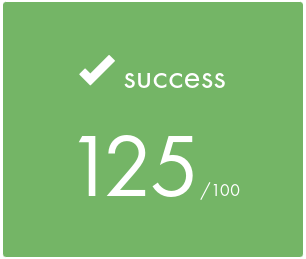

# <div align="center">⚙️ push_swap (a [42](https://42perpignan.fr/) project) ⚙️</div>

This project consists in sorting a list of numbers in ascending order. But, for that, we can only use some given moves.
To get the best grade, the number of moves has to be optimized to be the less possible.
As a parameter, the program take a list of random numbers, each one between INT_MIN and INT_MAX. This list is called the **stack a**. Then, it uses another list, called the **stack b**, which is empty at start, to sort the **stack a**.

The bonus consists in making another program, called **checker**, to check that the list returned by the push_swap program is well-sorted.

## Allowed moves
### Swap
Swaps the first and the second element of a list.
**sa** to perform it in the stack a.
**sb** to perform it in the stack b.

### Push
Pushes the first element of a stack on the other stack.
**pa** to push from stack b to stack a.
**pb** to push from stack a to stack b.

### Rotate
Puts the first element of a stack at the end of the stack.
**ra** to rotate the stack a.
**rb** to rotate the stack b.
**rr** to rotate both of the stacks.

### Reverse Rotate
Puts the last element of a stack at the top of the stack.
**rra** to reverse rotate the stack a.
**rrb** to reverse rotate the stack b.
**rrr** to reverse rotate both of the stack.

## How to install ?
Type the following commands on a bash terminal to install the program:
```bash
git clone https://github.com/Arawyn42/42_push_swap
```
```bash
cd 42_push_swap
```
```bash
make
```
```bash
make bonus
```
```bash
make clean
```

## How to use ?
```bash
ARG="list_of_numbers"; ./push_swap $ARG
```
Replace *list_of_numbers* with something like *15 99 -62 54 23 8 -155963*, numbers separated by spaces.

This will give you all the moves you need to perform on the stack to sort it in ascending order.

If you want to check that the list is well sorted, use the following command:
```bash
ARG="list_of_numbers"; ./push_swap $ARG | ./checker $ARG
```

## Grade

